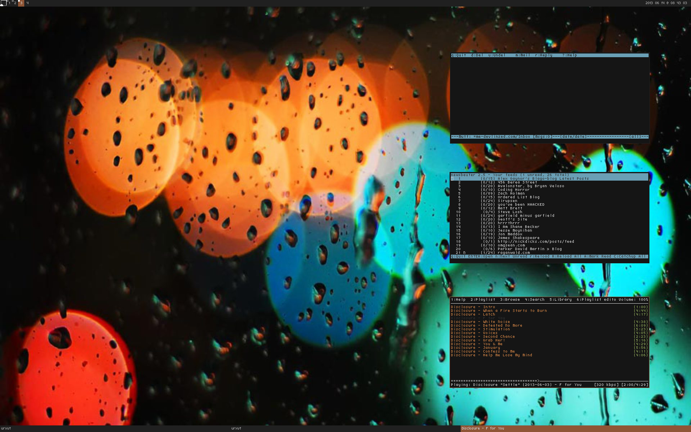

devlin zed's dotfiles
=====================

i use ubuntu with a hint of mac os x.  this repository contains my user-level
configuration files.



install
=======

```sh
git clone https://github.com/devlinzed/dotfiles ~/.dotfiles
cd ~/.dotfiles
./bootstrap
```

this will:

1. check out the git submodules and update them if you've checked out a branch
2. create symlinks (see "folder structure" below)
3. install the required system-wide ruby gems
4. install the proper font for powerline
5. update luakit's adblock subscriptions
6. compile anything that needs compiling

the bootstrap script is idempotent and you can run it again to update symlinks
and vim plugins.  you may need to run it as root.

do a `git grep` for `/home/devlin` and `.dotfiles` and replace those, too!

what i use
==========

this is a very opinionated repository and it configures and utilizes the
following programs.

* **color scheme**: [base16](https://github.com/chriskempson/base16)
* **email**: [mutt](http://mutt.org/)
* **feed reader**: [newsbeuter](http://newsbeuter.org/)
* **font**: [cure](http://artwizaleczapka.sourceforge.net/)
* **gtk theme**: [elegant brit](http://grvrulz.deviantart.com/art/Elegant-Brit-gnome3-208925032)
* **music player**: [ncmpcpp](http://ncmpcpp.rybczak.net/)
* **operating system**: [arch linux](http://archlinux.org)
* **password manager**: [pass](http://zx2c4.com/projects/password-store/)
* **shell**: [zsh](http://zsh.org/)
* **terminal emulator**: [rxvt-unicode-256color](https://en.wikipedia.org/wiki/Rxvt)
* **text editor**: [vim](http://vim.org)
* **web browser**: [luakit](http://luakit.org)
* **window manager**: [awesome](http://awesome.naquadah.org/)

recommended & required tools
============================

some programs or scripts rely on secondary programs.  to properly use
everything in this repository, you'll need to install these as well.

* [beets](http://beets.radbox.org) for managing my music library
* [exuberant ctags](http://ctags.sourceforge.net/) for indexing my code
* [git](http://git-scm.org) for version control
* [isync](http://isync.sourceforge.net/) for receiving email
* [keychain](http://www.funtoo.org/wiki/Keychain) for managing your ssh and gpg
  agents & passphrases
* [matcher](https://github.com/burke/matcher) for approximate string matching
* [mpd](http://mpd.wikia.com/wiki/Music_Player_Daemon_Wiki) for serving music
  to ncmpcpp
* [msmpt](http://msmtp.sourceforge.net) for sending email
* [notmuch](http://notmuchmail.org/) for indexing and searching email
* [the silver searcher](https://github.com/ggreer/the_silver_searcher) for
  replacing grep
* [wkhtmltopdf](http://code.google.com/p/wkhtmltopdf/) for rendering markdown
  for printing

folder structure
================

- **bin/**: anything in `bin/` will get added to your `$PATH` and be made
  available everywhere

- **functions/**: these are lazy loaded as ZSH functions

- **topic/\*.zsh**: any files ending in `.zsh` get loaded into your environment

- **topic/\*.symlink**: any files ending in `*.symlink` get symlinked into your
  `$HOME`

- **topic/\*.completion.zsh**: any files ending in `completion.zsh` get loaded
  last so that they get loaded after we set up zsh autocomplete functions

license
-------

see `UNLICENSE.md`
